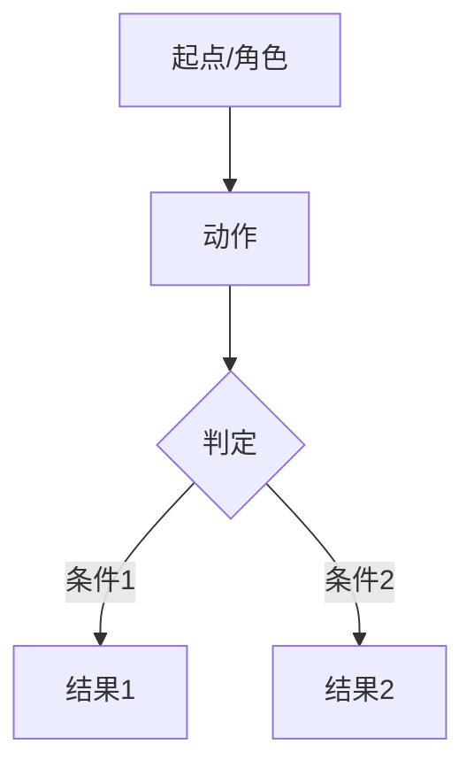

# <模块名> 规格

> 本页是该模块的**最新全量规格**（WHAT）。由 `/sdd:archive-change` 在归档时创建/更新，始终反映已归档变更累积出的当前事实。
> 历史版本见 `archive/<YYYYMMDD-变更名>/`，演进时间线见 [log.md](log.md)。

## 概述
<模块用途与边界>

## 流程图
<本模块的核心流程/状态图，用 mermaid 表达，Obsidian 与 GitHub 均原生渲染。按需选用：>
<- 有用户交互流程 → `flowchart TD`：角色→动作→页面/节点→产出，覆盖主流程与关键分支>
<- 有状态机（如审批、处理状态）→ `stateDiagram-v2`：标注状态与流转条件，对应 BR 编号>
<- 与其他模块有数据/调用往来 → 在图中以 `[(表名)]`、外部模块节点表示，并与"交叉引用"一致>

## 功能需求（FR）
<按 knowledge/rules/requirements-spec.md 格式。跨模块引用用 [模块名](模块名-spec.md#FR-XXX)>

## 非功能需求（NFR）

## 业务规则（BR）

## 数据模型
<本模块实体。若与其他模块共享，链接到 [data-model.md](data-model.md)>

## API 接口

## 验收标准

## 交叉引用
- **依赖**：<本模块依赖的其他模块规格，带链接>
- **被依赖**：<依赖本模块的其他模块>
- **相关术语**：<引用 [glossary.md](glossary.md) 中的条目>
